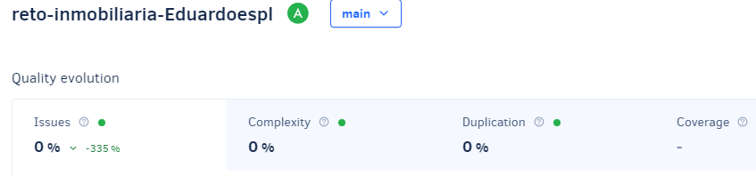
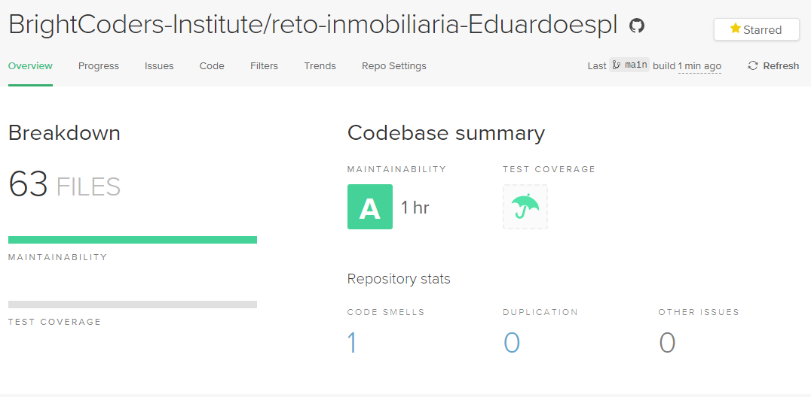
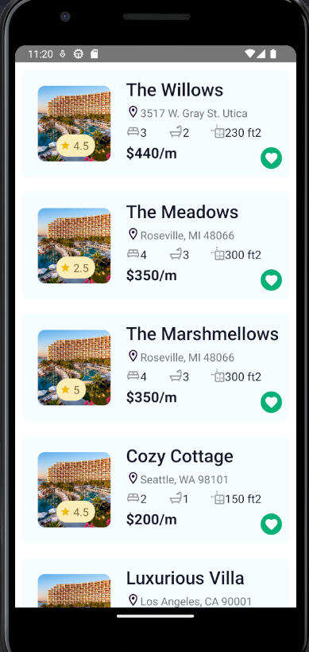

# App Inmobiliaria

> [Ver instrucciones antes de iniciar](./instructions.md)

## Table of Contents
- [Description](#description)
- [Installation and Run](#installation-and-run)
- [How to use](#how-to-use)
- [Credits](#credits)
- [Badges](#badges)
- [App Screenshots](#app-screenshots)

## Description
This is a real state app that allows the clients to see the properties that are available for rent or sale. The clients can also see the details of the properties and contact the real state agency to get more information about the properties. Some details of the properties are: name, location, number of rooms, number of bathrooms, surface, price per month, rate and an icon that allows the user to mark the property as favorite.

## Installation and Run
- Clone this repo: `git clone`
- Change to the repo directory: `cd InmobiliariaApp`
- Install all required dependencies: `npm install`
- Run the app: `npm react-native start`
- Run the app on Android: `npm react-native run-android`
- Run the app on iOS: `npm react-native run-ios`

## How to use
- When the app is opened, the user can see the list of properties that are available for rent or sale.
- Scroll down to see all the properties.
- To modify or add a property, edit the file `src/data/properties.js` and add a new one following the same structure. Properties are displayed in the same order as they are in the file.

## Credits
- [BrightCoders](http://www.brightcoders.com/)
- [Eduardoespl](eduardoesp3317@gmail.com)

## Badges
# Qualification with Codacy

# Qualification with CodeClimate

## App Screenshots

